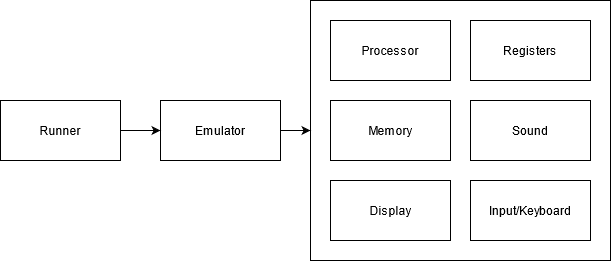

# chip-8-interpreter

This will become a chip-8-interpreter once it's fully complete. This is currently a work in progress - more to come soon.

This project is done for fun and educational purpose to learn how the emulation of systems work.

## General Structure Plan

- Runner will be the main entry point of the emulator.
- Emulator will be the controlling unit, that connects all the lower level components and orchestrates them.
- Processor will be the component for all cpu related code e.g. fetch, decode and execute opcode.
- Register will be the component for all needed registers.
- Memory will be the component for all memory related code.
- Sound will be the component responsible for the sound.
- Display will be the component responsible for drawing the image.
- Input/Keyboard will be the component for the inputs.

The following graphic shows the planned structure:

## Docs & References

- [Chip-8 General Information](https://en.wikipedia.org/wiki/CHIP-8)
- [Chip-8 Technical Reference](https://github.com/mattmikolay/chip-8/wiki/Mastering-CHIP%E2%80%908)
- [Helpful guide on emulating the Chip-8](http://www.codeslinger.co.uk/pages/projects/chip8.html)
- [Another helpful guide on emulating the Chip-8](https://austinmorlan.com/posts/chip8_emulator/)

